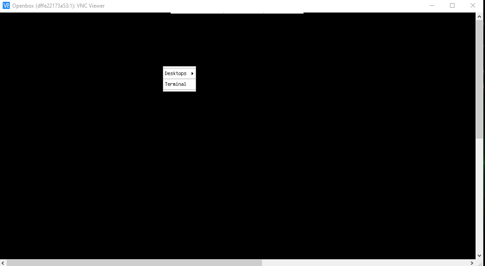
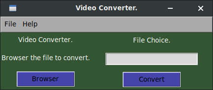

# Video Converter 

**Video Converter is a application for conveter videos(mp4) to audio(mp3). With a util interface to use.**

## Docker Installation (Recommended)

__Install from docker image, and run a container.__

```bash
$ docker run -d -p 5900:5900 --name video-app eduarddan/video-converter-app
```

__Now that we have an instance of the image . We can access it because in the image we use a vnc server to be able to see the application graphically.__ Using [VNC Viewer](https://www.realvnc.com/es/connect/download/viewer/) in Windows or other platforms.

__Once you have created a connection in vnc viewer you can execute the app, open the terminal and executing the command:__

```bash
$ app
```

### Images.



## Dependencies.

_For install the basics dependencies, execute:_

```bash
$ pip3 install -r requirements.txt
```

**This proyect use tkinter for create the interface.**

### Tkinter Installation.

#### Windows

```cmd
> pip install python3-tk
```

#### Linux Debian/Ubuntu.

```bash
$ sudo apt install python3-tk
```

## Installation.

```bash
$ git clone https://github.com/EduardYan/video-converter
$ cd video-converter/

```

## Run.

**Only execute the file index.py**

```bash
$ python3 index.py
```

**or**

```bash
$ ./index.py
```

## Screenshot



## Bugs or Problems.

<a href="mailto:eduarygp@gmail.ocm">Contact Me.</a>
